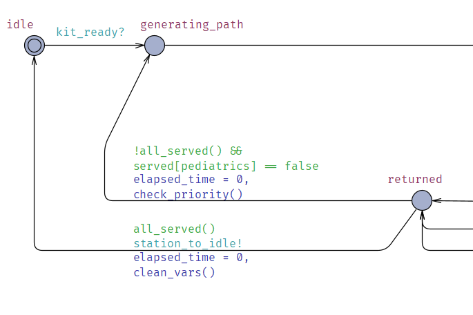

# Formal Modeling of Human-Robot Interactions at the Pharmacy of HC-UFPE

This repository contains the formal model and verification queries for the project **Modeling and verification of a robotic system for assembling and distributing medicines in hospital environments**, developed using [UPPAAL](https://uppaal.org/). 

The objective of this project is to model and verify interactions between robots and humans in a hospital pharmacy environment, ensuring the system operates efficiently and meets safety and operational constraints.

---

## Project Overview

The project is structured as follows:
- **Devised Human-Robot Interactions:** Definition of the main interactions modeled.
- **Model Structure:** Explanation of how the automata are organized.
- **Parameters:** Description of key parameters used in the models.
- **Specific Models:** Details of individual agents like the robot assembler, human validator, and sectors.

---

## Formal Modeling  


### Model of Sector
The Sector Automaton is responsible for managing the operations of different sectors.


### Model of Robot Assembler
In the obedience path, while the robot is working, it checks the number of kits in the medication queue and starts preparing them. After completing the ticket assembly, it moves to the finish ticket state, where it waits for another sector’s ticket request. 


if the robot disobeys, it checks which sector it was about to assemble the ticket for.


### Model of Human Validator
The Human Validator Automaton describes the interaction of a human responsible for validating the assembled kits in the system.


### Model of Robot Deliver
The Robot Deliver automaton was designed to perform the delivery of medication kits to the different sectors of the
hospital. The robot’s logic involves a series of steps and checks to ensure that the kits are delivered efficiently. 

During the replenishment phase, the robot enters the loading
kits state. If still has kits to fill and then moves back to the working state.


Once loaded with the kits, it heads to the corresponding sector to make the delivery. In each delivery, the robot checks if it can deliver the kits based on the remaining kits and the current sector. 


The check to see if all sectors have been served is done by the function `all_served()`, which ensures that the
delivery is complete before the robot returns to the idle state.

After returning, the robot resets its simulation and clears its
internal variables, preparing for the next round of deliveries.



### Model of Human Receiver
The Human Receiver automaton is responsible for managing the reception of medication kits in the different sectors of the hospital. 


---

## Queries

Below is a table with the queries used in the model, including their descriptions:

|**Query**                                                                                          | **Description**                                                                                                     |
|----------------------------------------------------------------------------------------------------|-------------------------------------------------------------------------------------------------------------------|
| `A[] not deadlock`                                                                                 | Ensures that the system does not enter a deadlock state.                                                           |
| `E<> served[icu] && served[emergency] && served[pediatrics]`                                       | Checks if all sectors (ICU, emergency, and pediatrics) can be served.                                              |
| `E<> elapsed_time > 0 && (ticket_queue[icu] == empty && ticket_queue[emergency] == empty && ticket_queue[pediatrics] == empty)` | Confirms that all tickets can be processed and the queues will eventually become empty.                          |
| `A[] forall(i : int[0,2]) delivery_ticket_queue[i] >= empty`                                       | Ensures that the delivery queues never contain invalid values.                                                     |
| `E<> forall(i : int[0,2]) delivery_ticket_queue[i] == empty`                                       | Verifies if all delivery queues can be emptied at some point.                                                      |
| `A[] delivery_ticket_queue[icu] > 0 imply delivery_priority == icu`                               | Ensures that if there are tickets in the ICU queue, it will have delivery priority.                                 |
| `A[] num_kits <= max_num_kits`                                                                     | Ensures that the number of kits never exceeds the maximum allowed limit.                                           |
| `A[] forall(i : int[0,2]) (delivery_priority == i && delivery_ticket_queue[i] > 0) imply time_to_deliver_kit <= 10` | Checks if deliveries to any prioritized sector occur within the maximum allowed time.                             |

---

## How to Use

1. **Clone this repository:**
   ```bash
   git clone https://github.com/joaoribeirosl/hospital_timed_automata.git
   
2. **download the xml file.**
3. **open xml file in UPPAAL.**

## Contact
For questions or suggestions, feel free to reach out:

- Author: João Ribeiro Sena de Lira
- Email: joaoribeiroslira@gmail.com
